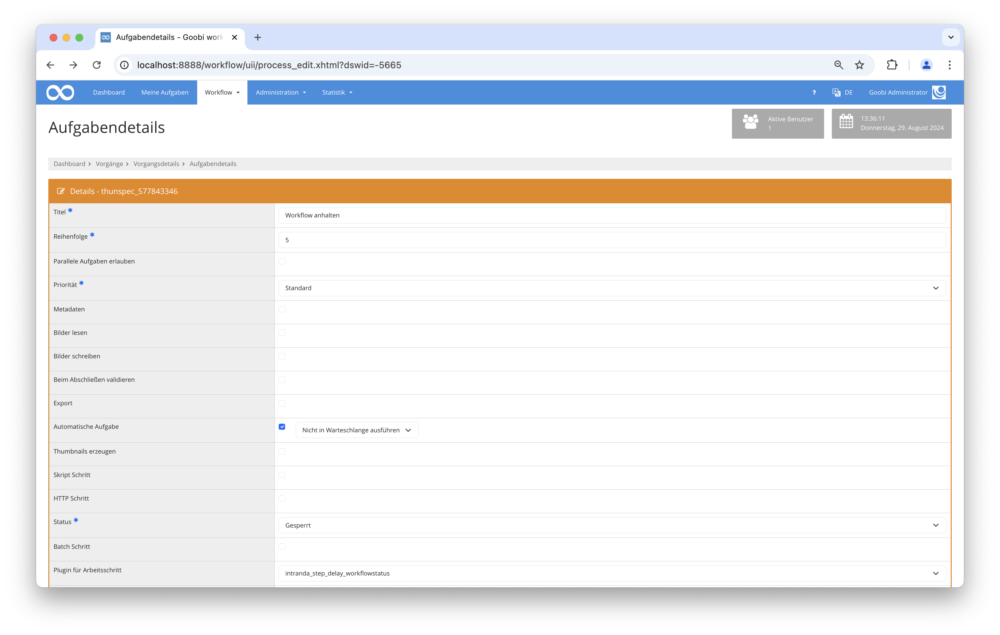

## Einführung
Diese Dokumentation erläutert das Plugin, das es erlaubt einen Workflow für eine bestimmte Zeitspanne zu pausieren.

## Installation
Um das Plugin nutzen zu können, müssen folgende Dateien installiert werden:

```bash
/opt/digiverso/goobi/plugins/step/plugin-step-delay-base.jar
/opt/digiverso/goobi/config/plugin_intranda_delay_configurable.xml
```

Nach der Installation des Plugins kann dieses innerhalb des Workflows für die jeweiligen Arbeitsschritte ausgewählt und somit automatisch ausgeführt werden.

Für die Verwendung des Plugins muss dieses in einem Arbeitsschritt ausgewählt sein:




## Überblick und Funktionsweise
Dieses Plugin pausiert den Workflow, solange wie es in der Konfigurationsdatei angegeben ist. Ist der konfigurierte Zeitpunkt erreicht, wird der betreffende Arbeitsschritt automatisch geschlossen und der weitere Workflow fortgeführt.

## Konfiguration
Die Konfiguration des Plugins erfolgt in der Datei `plugin_intranda_delay_configurable.xml` wie hier aufgezeigt:

{{CONFIG_CONTENT}}

{{CONFIG_DESCRIPTION_PROJECT_STEP}}

Parameter               | Erläuterung
------------------------|------------------------------------
`delayInDays`           | Pausierung des Workflows in Tagen. |