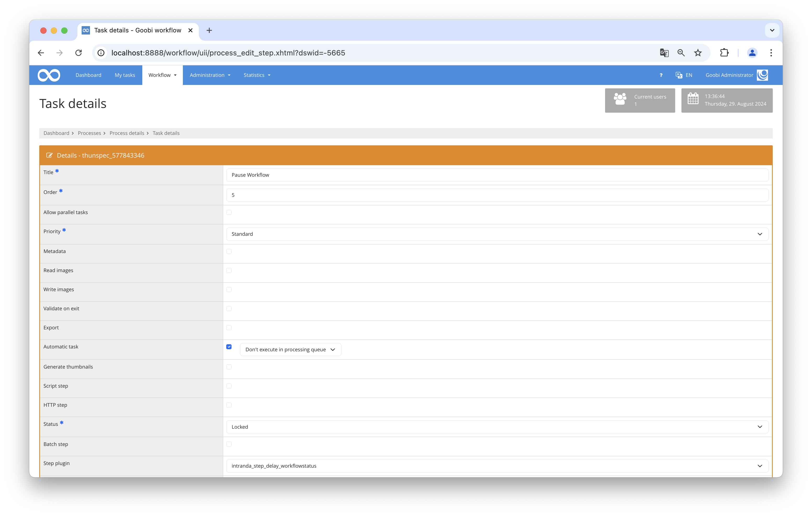

## Introduction
This documentation explains the plugin that pauses the workflow.

## Installation
To be able to use the plugin, the following files must be installed:

```bash
/opt/digiverso/goobi/plugins/step/plugin-step-delay-base.jar
/opt/digiverso/goobi/config/plugin_intranda_delay_configurable.xml
```

After installing the plugin, it can be selected within the workflow for the respective steps and will be executed automatically.

To use the plugin, it must be selected in a workflow step:




## Overview and functionality
This plugin pauses the workflow for as long as specified in the configuration file.


## Configuration
The plugin is configured in the file `plugin_intranda_delay_configurable.xml` as shown here:

{{CONFIG_CONTENT}}

{{CONFIG_DESCRIPTION_PROJECT_STEP}}

Parameter               | Explanation
------------------------|------------------------------------
`delayInDays`           | Pause the workflow for the specified days. |
